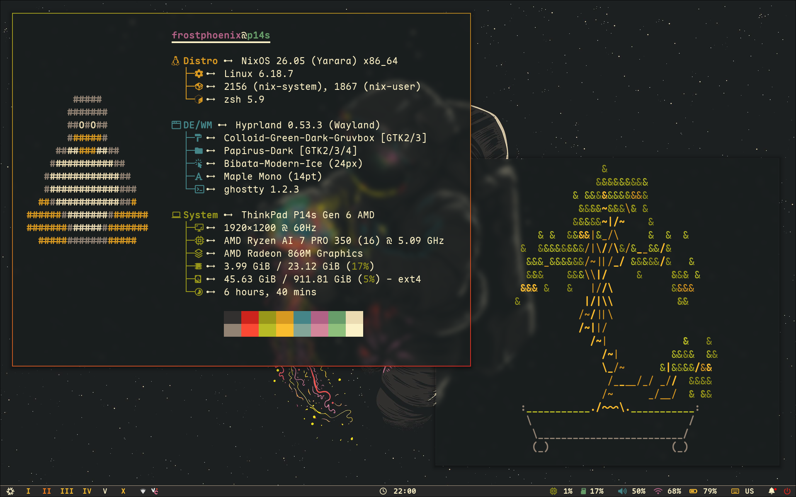
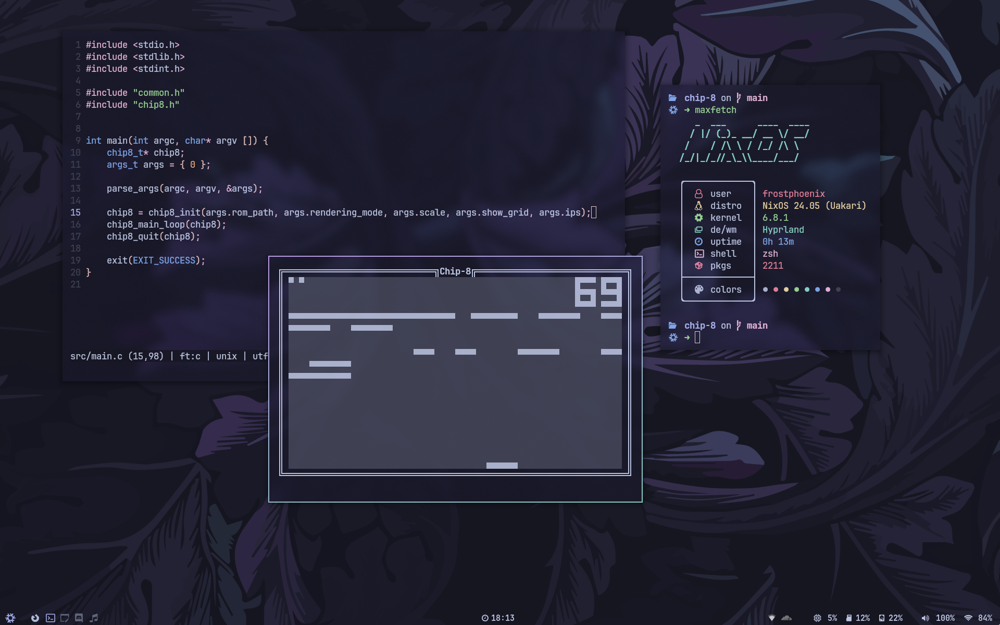
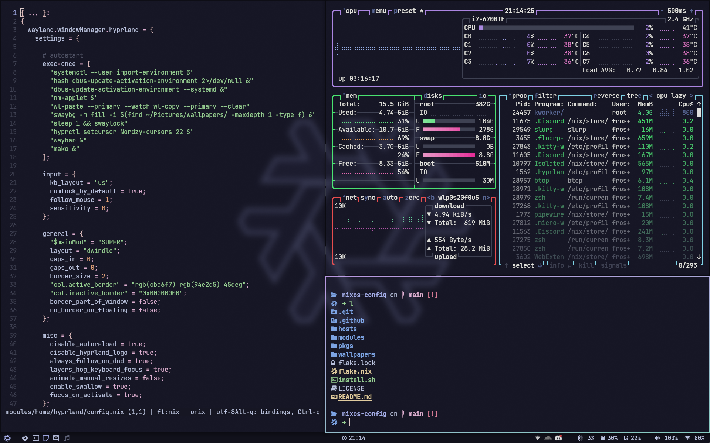
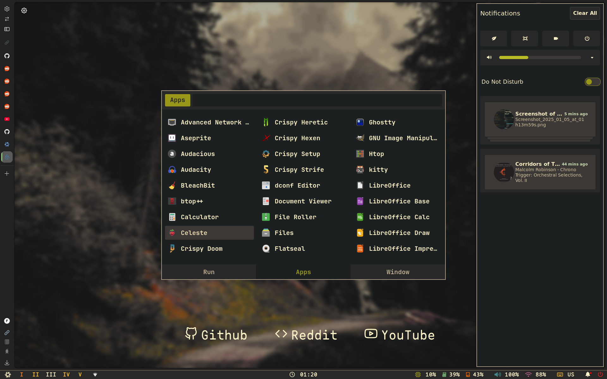
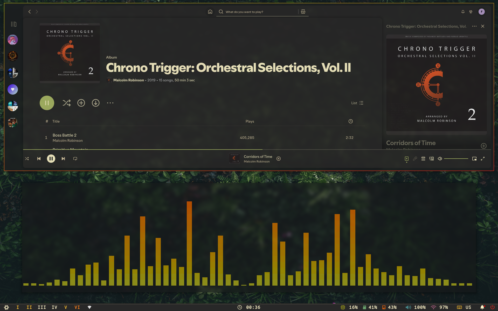
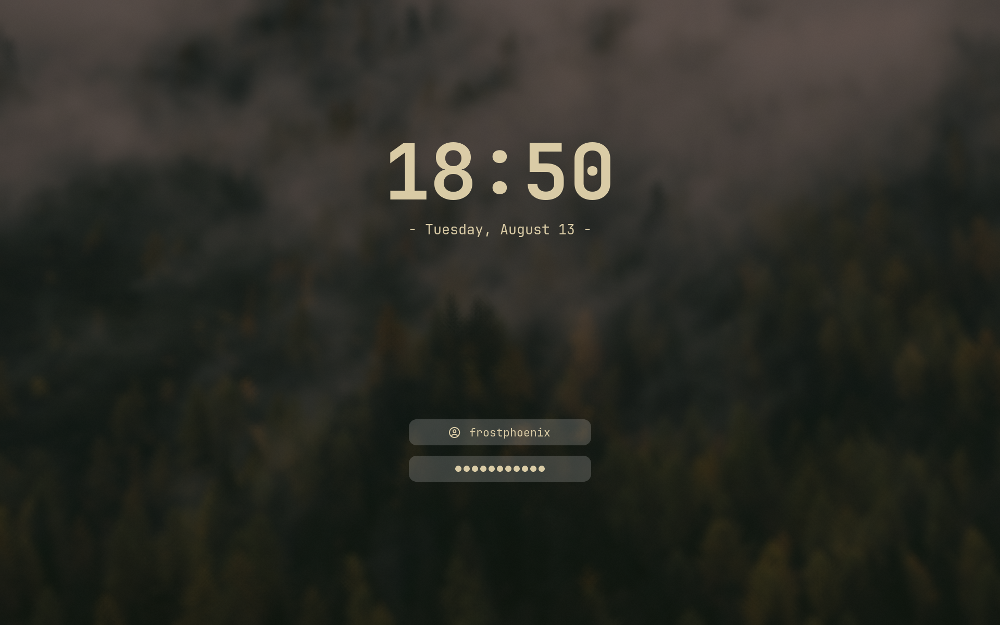
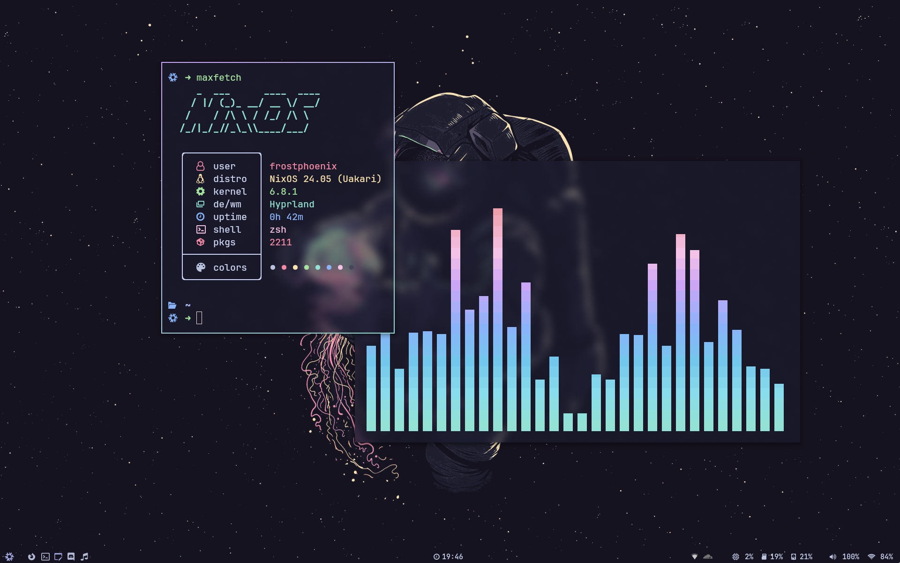
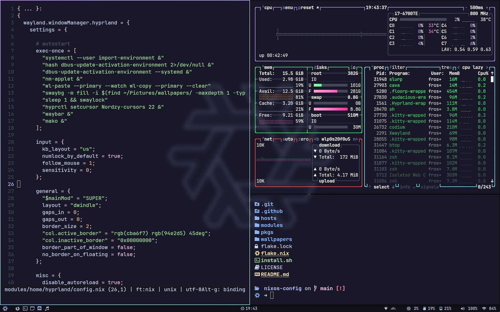
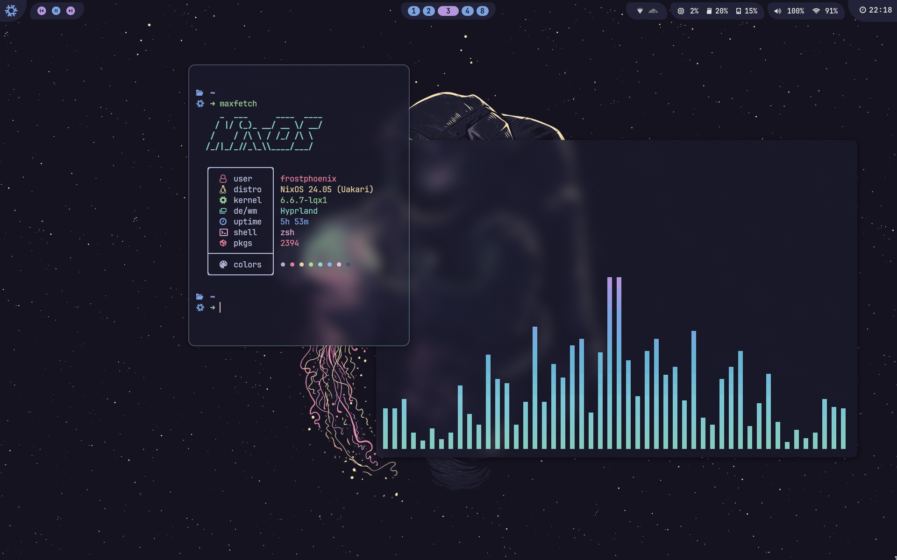

<h1 align="center">
    
   <br>
      Frost-Phoenix's Flakes 
   <br>
       <br>

   <div align="center">
      <p></p>
      <div align="center">
         <a href="https://github.com/Frost-Phoenix/nixos-config/stargazers">
            
         </a>
         <a href="https://github.com/Frost-Phoenix/nixos-config/">
            
         </a>
         <a = href="https://nixos.org">
            
         </a>
         <a href="https://github.com/Frost-Phoenix/nixos-config/blob/main/LICENSE">
            
         </a>
      </div>
      <br>
   </div>
</h1>


### 🖼️ Gallery

<p align="center">
    <br>
    <br>
    <br>
    <br>
    <br>
    <br>
   Screenshots last updated <b>2025-01-05</b>
</p>

Here is my previous Catppuccin rice. You can find it [here](https://github.com/Frost-Phoenix/nixos-config/tree/catppuccin)
<details>
<summary>
Catppuccin (EXPAND)
</summary>
<p align="center">
    <br>
    <br>
    <br>
</p>  
   <details>
   <summary>
   Old Catppuccin (EXPAND)
   </summary>
   <p align="center">
       <br>
       <br>
       <br>
   </p>
   </details>
</details>

# 🗃️ Overview

## 📚 Layout

-   [flake.nix](flake.nix) base of the configuration
-   [hosts](hosts) 🌳 per-host configurations that contain machine specific configurations
    - [desktop](hosts/desktop/) 🖥️ Desktop specific configuration
    - [laptop](hosts/laptop/) 💻 Laptop specific configuration
    - [vm](hosts/vm/) 🗄️ VM specific configuration
-   [modules](modules) 🍱 modularized NixOS configurations
    -   [core](modules/core/) ⚙️ Core NixOS configuration
    -   [homes](modules/home/) 🏠 my [Home-Manager](https://github.com/nix-community/home-manager) config
-   [pkgs](flake/pkgs) 📦 Packages Build from source
-   [wallpapers](wallpapers/) 🌄 wallpapers collection

## 📓 Components
|                             | NixOS + Hyprland                                                                              |
| --------------------------- | :---------------------------------------------------------------------------------------------:
| **Window Manager**          | [Hyprland][Hyprland] |
| **Bar**                     | [Waybar][Waybar] |
| **Application Launcher**    | [rofi][rofi] |
| **Notification Daemon**     | [swaync][swaync] |
| **Terminal Emulator**       | [Ghostty][Ghostty] |
| **Shell**                   | [zsh][zsh] + [powerlevel10k][powerlevel10k] |
| **Text Editor**             | [VSCodium][VSCodium] + [Neovim][Neovim] |
| **network management tool** | [NetworkManager][NetworkManager] + [network-manager-applet][network-manager-applet] |
| **System resource monitor** | [Btop][Btop] |
| **File Manager**            | [nemo][nemo] + [yazi][yazi] |
| **Fonts**                   | [Maple Mono][Maple Mono] |
| **Color Scheme**            | [Gruvbox Dark Hard][Gruvbox] |
| **GTK theme**               | [Colloid gtk theme][Colloid gtk theme] |
| **Cursor**                  | [Bibata-Modern-Ice][Bibata-Modern-Ice] |
| **Icons**                   | [Papirus-Dark][Papirus-Dark] |
| **Lockscreen**              | [Hyprlock][Hyprlock] + [Swaylock-effects][Swaylock-effects] |
| **Image Viewer**            | [imv][imv] |
| **Media Player**            | [mpv][mpv] |
| **Music Player**            | [audacious][audacious] |
| **Screenshot Software**     | [grimblast][grimblast] |
| **Screen Recording**        | [wf-recorder][wf-recorder] + [OBS][OBS] |
| **Clipboard**               | [wl-clip-persist][wl-clip-persist] |
| **Color Picker**            | [hyprpicker][hyprpicker] |


## 📝 Shell aliases

<details>
<summary>
Utils (EXPAND)
</summary>

- ```c```     $\rightarrow$ ```clear```
- ```cd```    $\rightarrow$ ```z```
- ```tt```    $\rightarrow$ ```gtrash put```
- ```vim```   $\rightarrow$ ```nvim```
- ```cat```   $\rightarrow$ ```bat```
- ```nano```  $\rightarrow$ ```micro```
- ```code```  $\rightarrow$ ```codium```
- ```diff```  $\rightarrow$ ```delta --diff-so-fancy --side-by-side```
- ```less```  $\rightarrow$ ```bat```
- ```y```     $\rightarrow$ ```yazi```
- ```py```    $\rightarrow$ ```python```
- ```ipy```   $\rightarrow$ ```ipython```
- ```icat```  $\rightarrow$ ```kitten icat```
- ```dsize``` $\rightarrow$ ```du -hs```
- ```pdf```   $\rightarrow$ ```tdf```
- ```open```  $\rightarrow$ ```xdg-open```
- ```space``` $\rightarrow$ ```ncdu```
- ```man```   $\rightarrow$ ```BAT_THEME='default' batman```
- ```l```     $\rightarrow$ ```eza --icons  -a --group-directories-first -1```
- ```ll```    $\rightarrow$ ```eza --icons  -a --group-directories-first -1 --no-user --long```
- ```tree```  $\rightarrow$ ```eza --icons --tree --group-directories-first```
</details>

<details>
<summary>
Nixos (EXPAND)
</summary>

- ```cdnix```      $\rightarrow$ ```cd ~/nixos-config && codium ~/nixos-config```
- ```ns```         $\rightarrow$ ```nom-shell --run zsh```
- ```nix-test```   $\rightarrow$ ```nh os test```
- ```nix-switch``` $\rightarrow$ ```nh os switch```
- ```nix-update``` $\rightarrow$ ```nh os switch --update```
- ```nix-clean```  $\rightarrow$ ```nh clean all --keep 5```
- ```nix-search``` $\rightarrow$ ```nh search```
</details>

<details>
<summary>
Git (EXPAND)
</summary>

- ```g```     $\rightarrow$ ```lazygit```
- ```gf```    $\rightarrow$ ```onefetch --number-of-file-churns 0 --no-color-palette```
- ```ga```    $\rightarrow$ ```git add```
- ```gaa```   $\rightarrow$ ```git add --all```
- ```gs```    $\rightarrow$ ```git status```
- ```gb```    $\rightarrow$ ```git branch```
- ```gm```    $\rightarrow$ ```git merge```
- ```gd```    $\rightarrow$ ```git diff```
- ```gpl```   $\rightarrow$ ```git pull```
- ```gplo```  $\rightarrow$ ```git pull origin```
- ```gps```   $\rightarrow$ ```git push```
- ```gpso```  $\rightarrow$ ```git push origin```
- ```gpst```  $\rightarrow$ ```git push --follow-tags```
- ```gcl```   $\rightarrow$ ```git clone```
- ```gc```    $\rightarrow$ ```git commit```
- ```gcm```   $\rightarrow$ ```git commit -m```
- ```gcma```  $\rightarrow$ ```git add --all && git commit -m```
- ```gtag```  $\rightarrow$ ```git tag -ma```
- ```gch```   $\rightarrow$ ```git checkout```
- ```gchb```  $\rightarrow$ ```git checkout -b```
- ```glog```  $\rightarrow$ ```git log --oneline --decorate --graph```
- ```glol```  $\rightarrow$ ```git log --graph --pretty='%Cred%h%Creset -%C(auto)%d%Creset %s %Cgreen(%ar) %C(bold blue)<%an>%Creset'```
- ```glola``` $\rightarrow$ ```git log --graph --pretty='%Cred%h%Creset -%C(auto)%d%Creset %s %Cgreen(%ar) %C(bold blue)<%an>%Creset' --all```
- ```glols``` $\rightarrow$ ```git log --graph --pretty='%Cred%h%Creset -%C(auto)%d%Creset %s %Cgreen(%ar) %C(bold blue)<%an>%Creset' --stat```
  
</details>

## 🛠️ Scripts

All the scripts are in ```modules/home/scripts/scripts/``` and are exported as packages in ```modules/home/scripts/default.nix```

<details>
<summary>
extract.sh 
</summary>

**Description:** This script extract ```tar.gz``` archives in the current directory.

**Usage:** ```extract <archive_file>```
</details>

<details>
<summary>
compress.sh 
</summary>

**Description:** This script compress a file or a folder into a ```tar.gz``` archives which is created in the current directory with the name of the chosen file or folder. 

**Usage:** ```compress <file>``` or ```compress <folder>```
</details>

<details>
<summary>
toggle_blur.sh 
</summary>

**Description:** This script toggles the Hyprland blur effect. If the blur is currently enabled, it will be disabled, and if it's disabled, it will be turned on. 

**Usage:** ```toggle_blur```
</details>

<details>
<summary>
toggle_oppacity.sh 
</summary>

**Description:** This script toggles the Hyperland oppacity effect. If the oppacity is currently set to 0.90, it will be set to 1, and if it's set to 1, it will be set to 0.90. 

**Usage:** ```toggle_oppacity```
</details>

<details>
<summary>
maxfetch.sh 
</summary>

**Description:** This script is a modified version of the [jobcmax/maxfetch][maxfetch] script.

**Usage:** ```maxfetch```
</details>

<details>
<summary>
music.sh 
</summary>

**Description:** This script is for managing Audacious (music player). If Audacious is currently running, it will be killed (stopping the music); otherwise, it will start Audacious in the 8th workspace and resume the music. 

**Usage:** ```music```
</details>

<details>
<summary>
runbg.sh 
</summary>

**Description:** This script runs a provided command along with its arguments and detaches it from the terminal. Handy for launching apps from the command line without blocking it. 

**Usage:** ```runbg <command> <arg1> <arg2> <...>```
</details>

## ⌨️ Keybinds

View all keybinds by pressing ```$mainMod F1``` and wallpaper picker by pressing ```$mainMod w```. By default ```$mainMod``` is the ```SUPER``` key. 

<details>
<summary>
Keybindings 
</summary>

##### show keybinds list
- ```$mainMod, F1, exec, show-keybinds```

##### keybindings
- ```$mainMod, Return, exec, wezterm start --always-new-process```
- ```ALT, Return, exec, [float; center] wezterm start --always-new-process```
- ```$mainMod SHIFT, Return, exec, [fullscreen] wezterm start --always-new-process```
- ```$mainMod, B, exec, hyprctl dispatch exec '[workspace 1 silent] floorp'```
- ```$mainMod, Q, killactive,```
- ```$mainMod, F, fullscreen, 0```
- ```$mainMod SHIFT, F, fullscreen, 1```
- ```$mainMod, Space, togglefloating,```
- ```$mainMod, D, exec, rofi -show drun```
- ```$mainMod SHIFT, D, exec, hyprctl dispatch exec '[workspace 4 silent] discord --enable-features=UseOzonePlatform --ozone-platform=wayland'```
- ```$mainMod SHIFT, S, exec, hyprctl dispatch exec '[workspace 5 silent] SoundWireServer'```
- ```$mainMod, Escape, exec, swaylock```
- ```ALT, Escape, exec, hyprlock```
- ```$mainMod SHIFT, Escape, exec, power-menu```
- ```$mainMod, P, pseudo,```
- ```$mainMod, J, togglesplit,```
- ```$mainMod, T, exec, toggle_oppacity```
- ```$mainMod, E, exec, nemo```
- ```$mainMod SHIFT, B, exec, toggle_waybar```
- ```$mainMod, C ,exec, hyprpicker -a```
- ```$mainMod, W,exec, wallpaper-picker```
- ```$mainMod, N, exec, swaync-client -t -sw```
- ```$mainMod SHIFT, W, exec, vm-start```

##### screenshot
- ```$mainMod, Print, exec, grimblast --notify --cursor --freeze save area ~/Pictures/$(date +'%Y-%m-%d-At-%Ih%Mm%Ss').png```
- ```,Print, exec, grimblast --notify --cursor --freeze copy area```

##### switch focus
- ```$mainMod, left, movefocus, l```
- ```$mainMod, right, movefocus, r```
- ```$mainMod, up, movefocus, u```
- ```$mainMod, down, movefocus, d```

##### switch workspace
- ```$mainMod, 1, workspace, 1```
- ```$mainMod, 2, workspace, 2```
- ```$mainMod, 3, workspace, 3```
- ```$mainMod, 4, workspace, 4```
- ```$mainMod, 5, workspace, 5```
- ```$mainMod, 6, workspace, 6```
- ```$mainMod, 7, workspace, 7```
- ```$mainMod, 8, workspace, 8```
- ```$mainMod, 9, workspace, 9```
- ```$mainMod, 0, workspace, 10```

##### same as above, but switch to the workspace
- ```$mainMod SHIFT, 1, movetoworkspacesilent, 1" # movetoworkspacesilent```
- ```$mainMod SHIFT, 2, movetoworkspacesilent, 2"```
- ```$mainMod SHIFT, 3, movetoworkspacesilent, 3"```
- ```$mainMod SHIFT, 4, movetoworkspacesilent, 4"```
- ```$mainMod SHIFT, 5, movetoworkspacesilent, 5"```
- ```$mainMod SHIFT, 6, movetoworkspacesilent, 6"```
- ```$mainMod SHIFT, 7, movetoworkspacesilent, 7"```
- ```$mainMod SHIFT, 8, movetoworkspacesilent, 8"```
- ```$mainMod SHIFT, 9, movetoworkspacesilent, 9"```
- ```$mainMod SHIFT, 0, movetoworkspacesilent, 10"```
- ```$mainMod CTRL, c, movetoworkspace, empty"```

##### window control
- ```$mainMod SHIFT, left, movewindow, l```
- ```$mainMod SHIFT, right, movewindow, r```
- ```$mainMod SHIFT, up, movewindow, u```
- ```$mainMod SHIFT, down, movewindow, d```
- ```$mainMod CTRL, left, resizeactive, -80 0```
- ```$mainMod CTRL, right, resizeactive, 80 0```
- ```$mainMod CTRL, up, resizeactive, 0 -80```
- ```$mainMod CTRL, down, resizeactive, 0 80```
- ```$mainMod ALT, left, moveactive,  -80 0```
- ```$mainMod ALT, right, moveactive, 80 0```
- ```$mainMod ALT, up, moveactive, 0 -80```
- ```$mainMod ALT, down, moveactive, 0 80```

##### media and volume controls
- ```,XF86AudioRaiseVolume,exec, pamixer -i 2```
- ```,XF86AudioLowerVolume,exec, pamixer -d 2```
- ```,XF86AudioMute,exec, pamixer -t```
- ```,XF86AudioPlay,exec, playerctl play-pause```
- ```,XF86AudioNext,exec, playerctl next```
- ```,XF86AudioPrev,exec, playerctl previous```
- ```,XF86AudioStop, exec, playerctl stop```
- ```$mainMod, mouse_down, workspace, e-1```
- ```$mainMod, mouse_up, workspace, e+1```

##### laptop brigthness
- ```,XF86MonBrightnessUp, exec, brightnessctl set 5%+```
- ```,XF86MonBrightnessDown, exec, brightnessctl set 5%-```
- ```$mainMod, XF86MonBrightnessUp, exec, brightnessctl set 100%+```
- ```$mainMod, XF86MonBrightnessDown, exec, brightnessctl set 100%-```

##### clipboard manager
- ```$mainMod, V, exec, cliphist list | rofi -dmenu -theme-str 'window {width: 50%;}' | cliphist decode | wl-copy```
</details>

# 🚀 Installation 

> [!CAUTION]
> Applying custom configurations, especially those related to your operating system, can have unexpected consequences and may interfere with your system's normal behavior. While I have tested these configurations on my own setup, there is no guarantee that they will work flawlessly for you.
> **I am not responsible for any issues that may arise from using this configuration.**

> [!NOTE]
> It is highly recommended to review the configuration contents and make necessary modifications to customize it to your needs before attempting the installation.

#### 1. **Install NixOs**

First install nixos using any [graphical ISO image](https://nixos.org/download.html#nixos-iso). 
> [!NOTE]
> Only been tested using the Gnome graphical installer and choosing the ```No desktop``` option durring instalation.

#### 2. **Clone the repo**

```bash
nix-shell -p git
git clone https://github.com/Frost-Phoenix/nixos-config
cd nixos-config
```
#### 3. **Install script**
> [!CAUTION]
> For some computers, the default rebuild command might get stuck due to CPU cores running out of RAM. To fix that modify the install script line: ```sudo nixos-rebuild switch --flake .#${HOST}``` to ```sudo nixos-rebuild switch --cores <less than your max number of cores> --flake .#${HOST}```

> [!TIP]
> As it is better to know what a script does before running it, you are advised to read it or at least see the [Install script walkthrough](#Install-script-walkthrough) section before execution.
   
Execute and follow the installation script :
```bash
./install.sh
```
  
#### 4. **Reboot**

After rebooting, the config should be applied, you'll be greeted by hyprlock prompting for your password.

#### 5. **Manual config**

Even though I use home manager, there is still a little bit of manual configuration to do:
- Set Aseprite theme (they are in the folder `./nixos-config/modules/home/aseprite/themes`).
- Configure the browser (for now, all browser configuration is done manually).
- Change the git account information in `./modules/home/git.nix`
```nix
programs.git = {
   ...
   userName = "Frost-Phoenix";
   userEmail = "67cyril6767@gmail.com";
   ...
};
```

## Install script walkthrough

A brief walkthrough of what the install script does.

#### 1. **Get username**

You will receive a prompt to enter your username, with a confirmation check.

#### 2. **Set username**

The script will replace all occurancies of the default usename ```CURRENT_USERNAME``` by the given one stored in ```$username```

#### 3. Create basic directories

The following directories will be created:
- ```~/Music```
- ```~/Documents```
- ```~/Pictures/wallpapers/others```

#### 4. Copy the wallpapers

Then the wallpapers will be copied into ```~/Pictures/wallpapers/others``` which is the folder in which the ```wallpaper-picker.sh``` script will be looking for them.

#### 5. Get the hardware configuration

It will also automatically copy the hardware configuration from ```/etc/nixos/hardware-configuration.nix``` to ```./hosts/${host}/hardware-configuration.nix``` so that the hardware configuration used is yours and not the default one.

#### 6. Choose a host (desktop / laptop)

Now you will need to choose the host you want. It depend on whether you are using a desktop or laptop (or a VM altho it can be really buggy).

#### 7. Choose whether to install aseprite or not

To reduce installation time, you can choose to skip installing Aseprite. The installation process for Aseprite is time-intensive as it requires compiling over 1100 C++ files from source.

#### 8. Build the system

Lastly, it will build the system using [nh](https://github.com/viperML/nh), which includes both the flake config and home-manager config.

# 👥 Credits

Other dotfiles that I learned / copy from:

- Nix Flakes
  - [nomadics9/NixOS-Flake](https://github.com/nomadics9/NixOS-Flake): This is where I start my nixos / hyprland journey.
  - [samiulbasirfahim/Flakes](https://github.com/samiulbasirfahim/Flakes): General flake / files structure
  - [justinlime/dotfiles](https://github.com/justinlime/dotfiles): Mainly waybar (old design)
  - [skiletro/nixfiles](https://github.com/skiletro/nixfiles): Vscodium config (that prevent it to crash)
  - [fufexan/dotfiles](https://github.com/fufexan/dotfiles)
  - [tluijken/.dotfiles](https://github.com/tluijken/.dotfiles): base rofi config
  - [mrh/dotfiles](https://codeberg.org/mrh/dotfiles): base waybar config

- README
  - [ryan4yin/nix-config](https://github.com/ryan4yin/nix-config)
  - [NotAShelf/nyx](https://github.com/NotAShelf/nyx)
  - [sioodmy/dotfiles](https://github.com/sioodmy/dotfiles)
  - [Ruixi-rebirth/flakes](https://github.com/Ruixi-rebirth/flakes)


<!-- # ✨ Stars History -->

<!-- <p align="center"></p> -->

<p align="center"></p>

<!-- end of page, send back to the top -->

<div align="right">
  <a href="#readme">Back to the Top</a>
</div>

<!-- Links -->
[Hyprland]: https://github.com/hyprwm/Hyprland
[Ghostty]: https://ghostty.org/
[powerlevel10k]: https://github.com/romkatv/powerlevel10k
[Waybar]: https://github.com/Alexays/Waybar
[rofi]: https://github.com/lbonn/rofi
[Btop]: https://github.com/aristocratos/btop
[nemo]: https://github.com/linuxmint/nemo/
[yazi]: https://github.com/sxyazi/yazi
[zsh]: https://ohmyz.sh/
[Swaylock-effects]: https://github.com/mortie/swaylock-effects
[Hyprlock]: https://github.com/hyprwm/hyprlock
[audacious]: https://audacious-media-player.org/
[mpv]: https://github.com/mpv-player/mpv
[VSCodium]:https://vscodium.com/
[Neovim]: https://github.com/neovim/neovim
[grimblast]: https://github.com/hyprwm/contrib
[imv]: https://sr.ht/~exec64/imv/
[swaync]: https://github.com/ErikReider/SwayNotificationCenter
[Maple Mono]: https://github.com/subframe7536/maple-font
[NetworkManager]: https://wiki.gnome.org/Projects/NetworkManager
[network-manager-applet]: https://gitlab.gnome.org/GNOME/network-manager-applet/
[wl-clip-persist]: https://github.com/Linus789/wl-clip-persist
[wf-recorder]: https://github.com/ammen99/wf-recorder
[hyprpicker]: https://github.com/hyprwm/hyprpicker
[Gruvbox]: https://github.com/morhetz/gruvbox
[Papirus-Dark]: https://github.com/PapirusDevelopmentTeam/papirus-icon-theme
[Bibata-Modern-Ice]: https://www.gnome-look.org/p/1197198
[maxfetch]: https://github.com/jobcmax/maxfetch
[Colloid gtk theme]: https://github.com/vinceliuice/Colloid-gtk-theme
[OBS]: https://obsproject.com/