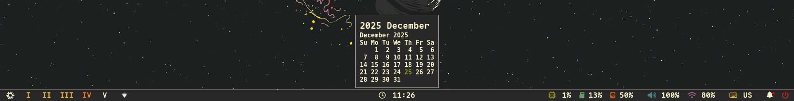
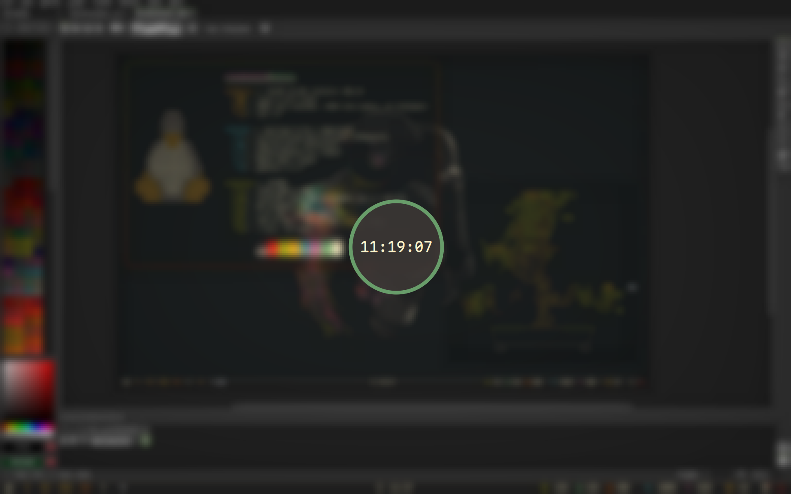
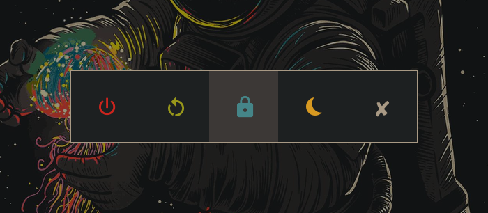
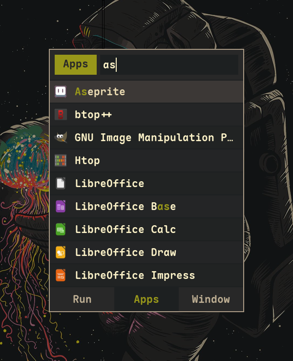
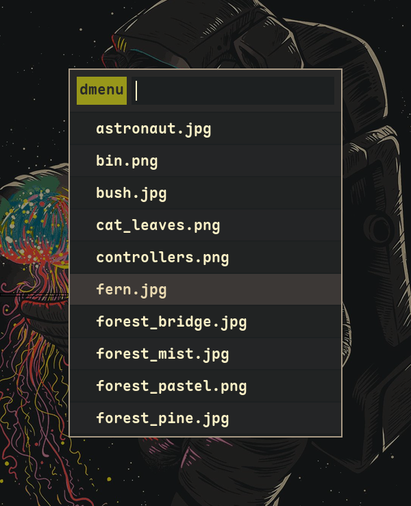
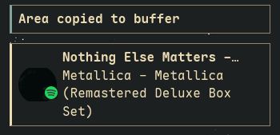
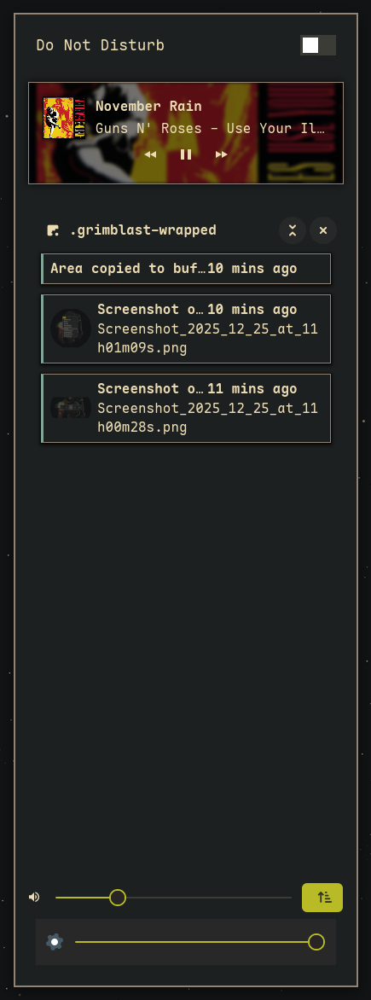

<h1 align="center">
    
   <br>
      Frost-Phoenix's Flakes 
   <br>
       <br>

   <div align="center">
      <p></p>
      <div align="center">
         <a href="https://github.com/Frost-Phoenix/nixos-config/stargazers">
            
         </a>
         <a href="https://github.com/Frost-Phoenix/nixos-config/">
            
         </a>
         <a = href="https://nixos.org">
            
         </a>
         <a href="https://github.com/Frost-Phoenix/nixos-config/blob/main/LICENSE">
            
         </a>
      </div>
      <br>
   </div>
</h1>

### 🖼️ Gallery

<p align="center">
    <br>
    <br>
    <br>
    <br>
   Screenshots last updated <b>2025-12-25</b>
</p>

<details>
<summary>
   Waybar (EXPAND)
</summary>
    <br>
</details>
<details>
<summary>
   Swaylock (EXPAND)
</summary>
    <br>
</details>
<details>
<summary>
   Hyprlock (EXPAND)
</summary>
    <br>
</details>
<details>
<summary>
   Power menu (EXPAND)
</summary>
    <br>
</details>
<details>
<summary>
   Launcher (EXPAND)
</summary>
    <br>
</details>
<details>
<summary>
   Wallpapers picker (EXPAND)
</summary>
    <br>
</details>
<details>
<summary>
   Notification (EXPAND)
</summary>
    <br>
</details>
<details>
<summary>
   Notification center (EXPAND)
</summary>
    <br>
</details>

You can find my previous Catppuccin rice [here](https://github.com/Frost-Phoenix/nixos-config/tree/catppuccin) (outdated).

# 🗃️ Overview

> [!IMPORTANT]
> This is my **personal** NixOS configuration, shared for reference and inspiration.
>
> **Please be aware:**
> - This configuration is constantly evolving - expect breaking changes
> - The README and documentation are most likely outdated
> - Features may be partially implemented or broken
> - I provide **no guarantees** of stability
>
> **Before using any part of this configuration:**
> 1. Review the code thoroughly
> 2. Understand what each module does
> 3. And adapt it to your specific needs

## 📚 Layout

-   [flake.nix](flake.nix) Base of the configuration
-   [hosts](hosts) Per-host configurations that contain machine specific configurations
    - [desktop](hosts/desktop/) Desktop specific configuration
    - [laptop](hosts/laptop/) Laptop specific configuration
    - [vm](hosts/vm/) VM specific configuration
-   [modules](modules) Modularized NixOS configurations
    -   [core](modules/core/) Core NixOS configuration
    -   [homes](modules/home/) My [Home-Manager](https://github.com/nix-community/home-manager) configuration
-   [pkgs](pkgs) Custom packages build from source
-   [scripts](scripts) Custom shell scripts
-   [wallpapers](wallpapers/) Wallpapers collection

## 🛠️ System Components & Applications

| Component | Software |
| --- | :---: |
| **Window Manager**          | [Hyprland][Hyprland] |
| **Bar**                     | [Waybar][Waybar] |
| **Application Launcher**    | [Rofi][Rofi] |
| **Notification Daemon**     | [swaync][swaync] |
| **Terminal Emulator**       | [Ghostty][Ghostty] |
| **Shell**                   | [zsh][zsh] + [powerlevel10k][powerlevel10k] |
| **Text Editor**             | [VSCodium][VSCodium] + [Neovim][Neovim] |
| **network management tool** | [NetworkManager][NetworkManager] + [network-manager-applet][network-manager-applet] |
| **System resource monitor** | [Btop][Btop] |
| **File Manager**            | [superfile][superfile] + [nemo][nemo] |
| **Fonts**                   | [Maple Mono][Maple Mono] |
| **Color Scheme**            | [Gruvbox Dark Hard][Gruvbox] |
| **GTK theme**               | [Colloid gtk theme][Colloid gtk theme] |
| **Cursor**                  | [Bibata-Modern-Ice][Bibata-Modern-Ice] |
| **Icons**                   | [Papirus-Dark][Papirus-Dark] |
| **Lockscreen**              | [Hyprlock][Hyprlock] + [Swaylock-effects][Swaylock-effects] |
| **Image Viewer**            | [imv][imv] |
| **Media Player**            | [mpv][mpv] |
| **Music Player**            | [audacious][audacious] |
| **Screenshot Software**     | [grimblast][grimblast] |
| **Screen Recording**        | [wf-recorder][wf-recorder] + [OBS][OBS] |
| **Clipboard**               | [wl-clip-persist][wl-clip-persist] |
| **Color Picker**            | [hyprpicker][hyprpicker] |


## 📝 Shell aliases

Shell aliases are defined in two places. You can find git related aliases in [`git.nix`](./modules/home/git.nix), and all the others in [`zsh_alias.nix`](./modules/home/zsh/zsh_alias.nix).

Some notable ones that can help you are:

| Alias | Command | Purpose |
|-------|---------|---------|
| `nft` | `nh-notify nh os test`   | Test configuration changes without modifying the bootloader |
| `nfs` | `nh-notify nh os switch` | Rebuild and activate the new system configuration |
| `nfu` | `nh-notify nh os switch --update` | Update all flake inputs and rebuild/activate the new configuration (system update) |
| `ns`  | `nom-shell --run zsh` | Enter a nix shell |
| `nd`  | `nom develop --command zsh` | Enter a development environment from a `flake.nix` file |
| `nb`  | `nom build` | Build packages exported by a flake |
| `nc`  | `nh-notify nh clean all --keep 5` | Clean up old Nix generations, keeping only the 5 most recent |
| `nsearch` | `nh search` | Search nixpkgs for available packages |

## 🛠️ Custom Scripts

All of the scripts are in the [`./scripts/scripts/`](./scripts/scripts/) folder and are exported as packages in [`./scripts/scripts.nix`](./scripts/scripts.nix).

Shell scripts are automatically discovered and exported as standalone packages. The package name becomes the script base name without its extension (i.e., `ascii.sh` will become the `ascii` command).

**Note:** Scripts must have names that end with `.sh` and be tracked by git to be automatically detected.
 
**Since scripts are exposed as packages, you can**:
- Run them directly from the terminal (e.g., `ascii`)
- Bind them to keybindings (see [binds.nix](./modules/home/hyprland/binds.nix) for examples)
- Call them from other scripts or automation tools

**To add your own script**:
1. Add a new `.sh` file to `./scripts/scripts/`
2. Ensure it's executable (chmod +x)
3. Add it to git (git add `./scripts/scripts/<name>.sh`)
4. Rebuild your configuration (`nfs` or `nft`)
5. The script will be automatically available as a command

**Location:** [`./scripts/`](./scripts/)

```
scripts/
├── scripts/            # All shell scripts are here
│   └── <script>.sh
└── scripts.nix         # Automatic scripts packaging
```

## ⌨️ Keybinds

Keybindings are defined in [`binds.nix`](./modules/home/hyprland/binds.nix). 

**Quick access:** Press `$mod F1` to view all keybinds.

Here are some of the main keybinds:

| Category | Key Examples | Purpose |
|----------|--------------|---------|
| **Navigation** | `$mod + 0-9/arrow keys` | workspace & window navigation |
| **Applications** | `$mod + return/d/b/e` | terminal, launcher, browser, file manager |
| **Window Control** | `$mod + q/f/space` | close, fullscreen, float windows |
| **Media & Tools** | `Print`, `$mod + c/w` | screenshots, color picker, wallpaper picker |
| **System** | `$mod + escape/shift escape` | lockscreen, power menu |

# 🚀 Installation

> [!CAUTION]
> This is a **personal** configuration. Use at your own risk. I am not responsible for any issues that may arise from using this setup. Always review and adapt the configuration to your needs before installation.

> [!WARNING]
> **VM Usage Notice:** Hyprland does **not** officially support virtual machines. While it often works, you may encounter graphical issues, performance problems, or complete incompatibility depending on your VM configuration.
>
> If you wish to test this configuration in a VM, please review Hyprland's [VM guide](https://wiki.hypr.land/Getting-Started/Master-Tutorial/#vm) for setup recommendations and known limitations.

### Installation Steps

#### 1. **Install NixOS**
First, install NixOS using any [graphical ISO](https://nixos.org/download.html#nixos-iso).

*Tested with the GNOME installer using the "No desktop" option*

#### 2. **Clone the Repository**

```bash
nix-shell -p git
git clone https://github.com/Frost-Phoenix/nixos-config
cd nixos-config
```

The configuration expects the repo to be located at `$HOME/nixos-config`.

#### 3. **Run the Install Script**

> [!TIP]
> As it is better to know what a script does before running it, you are advised to read and understand it. You can find the install script [here](./install.sh)

```bash
./install.sh
```

The script will guide you through host selection and apply the configuration.

The installation phase can take quite some time depending on your machine.

> [!NOTE]
> If the build gets stuck , due to RAM constraints (see [PR #30](https://github.com/Frost-Phoenix/nixos-config/pull/30)), you may need to edit the script to limit CPU cores:
>
> ```diff
> # Change in install.sh:
> - sudo nixos-rebuild switch --flake .#${HOST}
> + sudo nixos-rebuild switch --cores 4 --flake .#${HOST}
> ```

#### 4. **Reboot**

After the installation completes, reboot your system. If the installation was successful, you should be greeted by Hyprlock.

#### 5. **Post Install**

Some manual configuration is still required:

- **Browser**: Configure your browser extensions, settings, etc. (for now, all browser configuration is done manually)
- **Aseprite Themes**: Import themes from aseprite [themes folder](./modules/home/aseprite/themes/)
- **Git Identity**: Update the [git.nix](./modules/home/git.nix) file with your name and email
```nix
programs.git = {
   ...
   userName = "<your_name>";
   userEmail = "<your_email>";
   ...
};
```

# 👥 Credits

Other dotfiles that I ~~copied~~ learned from:

- Nix Flakes
  - [nomadics9/NixOS-Flake](https://github.com/nomadics9/NixOS-Flake): This is where I start my nixos / hyprland journey.
  - [samiulbasirfahim/Flakes](https://github.com/samiulbasirfahim/Flakes): General flake / files structure
  - [justinlime/dotfiles](https://github.com/justinlime/dotfiles): Mainly waybar (old design)
  - [skiletro/nixfiles](https://github.com/skiletro/nixfiles): Vscodium config (that prevent it to crash)
  - [fufexan/dotfiles](https://github.com/fufexan/dotfiles)
  - [tluijken/.dotfiles](https://github.com/tluijken/.dotfiles): base rofi config
  - [mrh/dotfiles](https://codeberg.org/mrh/dotfiles): base waybar config

- README
  - [ryan4yin/nix-config](https://github.com/ryan4yin/nix-config)
  - [NotAShelf/nyx](https://github.com/NotAShelf/nyx)
  - [sioodmy/dotfiles](https://github.com/sioodmy/dotfiles)
  - [Ruixi-rebirth/flakes](https://github.com/Ruixi-rebirth/flakes)

- And many others I probably forgot to mention.

# 📜 License

This project is licensed under the **MIT License** - see the [LICENSE](./LICENSE) file for details.

<!-- # ✨ Stars History

<p align="center"></p> -->

<p align="center"></p>

<!-- end of page, send back to the top -->

<div align="right">
  <a href="#readme">Back to the Top</a>
</div>

<!-- Links -->

[Hyprland]: https://github.com/hyprwm/Hyprland
[Ghostty]: https://ghostty.org/
[powerlevel10k]: https://github.com/romkatv/powerlevel10k
[Waybar]: https://github.com/Alexays/Waybar
[Rofi]: https://github.com/davatorium/rofi
[Btop]: https://github.com/aristocratos/btop
[nemo]: https://github.com/linuxmint/nemo/
[zsh]: https://ohmyz.sh/
[Swaylock-effects]: https://github.com/mortie/swaylock-effects
[Hyprlock]: https://github.com/hyprwm/hyprlock
[audacious]: https://audacious-media-player.org/
[mpv]: https://github.com/mpv-player/mpv
[VSCodium]:https://vscodium.com/
[Neovim]: https://github.com/neovim/neovim
[grimblast]: https://github.com/hyprwm/contrib
[imv]: https://sr.ht/~exec64/imv/
[swaync]: https://github.com/ErikReider/SwayNotificationCenter
[Maple Mono]: https://github.com/subframe7536/maple-font
[NetworkManager]: https://wiki.gnome.org/Projects/NetworkManager
[network-manager-applet]: https://gitlab.gnome.org/GNOME/network-manager-applet/
[wl-clip-persist]: https://github.com/Linus789/wl-clip-persist
[wf-recorder]: https://github.com/ammen99/wf-recorder
[hyprpicker]: https://github.com/hyprwm/hyprpicker
[Gruvbox]: https://github.com/morhetz/gruvbox
[Papirus-Dark]: https://github.com/PapirusDevelopmentTeam/papirus-icon-theme
[Bibata-Modern-Ice]: https://www.gnome-look.org/p/1197198
[Colloid gtk theme]: https://github.com/vinceliuice/Colloid-gtk-theme
[OBS]: https://obsproject.com/
[superfile]: https://github.com/yorukot/superfile
