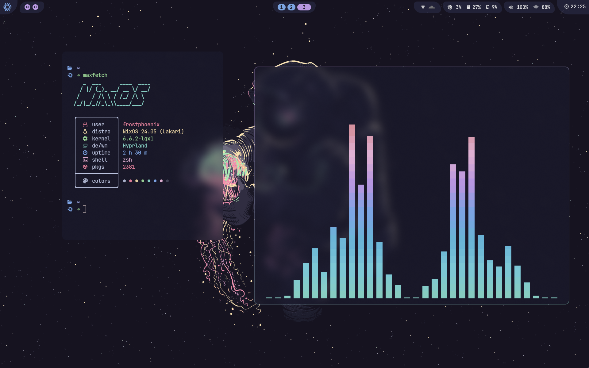

<h1 align="center">
    
    
      Frost-Phoenix's Flakes 
    
        
   

   

      

      

         
         
         
         
      

       
   

</h1>

 

     

   Screeenshot last updated <b>2023-12-22</b>

# 📦 Overview

-   [flake.nix](flake.nix) base of the configuration
-   [hosts](hosts) 🌳 per-host configurations that contain machine specific configurations
    - [nixos](hosts/nixos/) 🖥️ Default host
-   [modules](modules) 🍱 modularized NixOS configurations
    -   [core](modules/core/) ⚙️ Core NixOS configuration
    -   [homes](modules/home/) 🏠 my [Home-Manager](https://github.com/nix-community/home-manager) config
-   [pkgs](flake/pkgs) 💿 packages exported by my flake
-   [wallpapers](wallpapers/) 🌄 wallpapers collection

# 👥 Credits

Other dotfiles that inspired me:

- Nix Flakes
  - [nomadics9/NixOS-Flake](https://github.com/nomadics9/NixOS-Flake2): This is where I start my hyprland journey.
  - [samiulbasirfahim/Flakes](https://github.com/samiulbasirfahim/Flakes): General flake / files structure
  - [justinlime/dotfiles](https://github.com/justinlime/dotfiles): Mainly waybar
  - [fufexan/dotfiles](https://github.com/fufexan/dotfiles): gtk theme, xdg, git, media, anyrun, etc.

- README
  - [ryan4yin/nix-config](https://github.com/ryan4yin/nix-config)
  - [NotAShelf/nyx](https://github.com/NotAShelf/nyx)
  - [sioodmy/dotfiles](https://github.com/sioodmy/dotfiles)
  - [Ruixi-rebirth/flakes](https://github.com/Ruixi-rebirth/flakes)

---

  <a href="#readme">Back to the Top</a>

